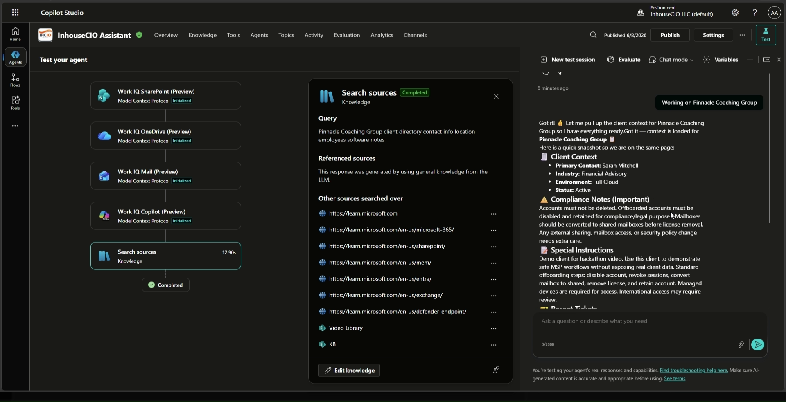
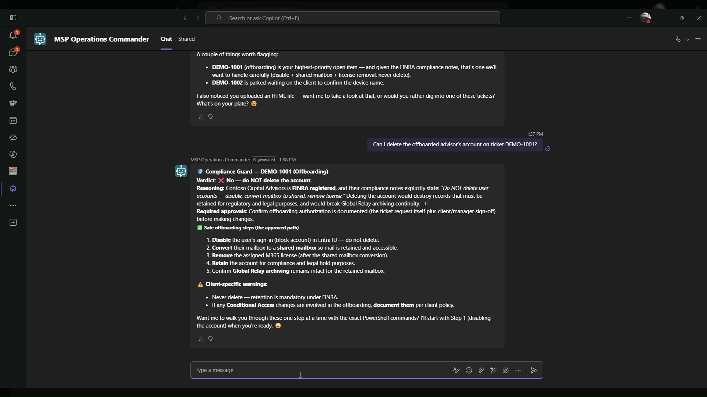
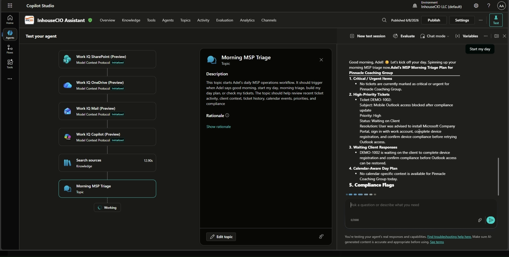

# 🚀 MSP Operations Commander

**AI-powered operations command center for Managed Service Providers — built with Microsoft Copilot Studio**

> Agents League Hackathon — Enterprise Agents Battle | June 2026

## 🎥 Demo Video

Watch the demo here: [MSP Operations Commander Demo](https://youtu.be/WI3j7Yl2z5I)

> For privacy, the demo uses fictional client and ticket data. No real client names, contacts, tickets, domains, tenant details, or sensitive information are shown.

> **Note on the agent name:** MSP Operations Commander was built in Microsoft Copilot Studio for this hackathon. The name **"InhouseCIO"** shown in the demo video is simply the agent's display name within the author's own Microsoft 365 environment — it refers to the same agent described here.

---

## 🔗 Quick Links

- 🎥 [Demo Video](https://youtu.be/WI3j7Yl2z5I)
- 🧩 [Setup Guide (docs/SETUP.md)](docs/SETUP.md)
- 🤝 [Contributing & Transparency](CONTRIBUTING.md)
- 📄 [License (MIT)](LICENSE)

---

## 📑 Table of Contents

- [Microsoft IQ Integration](#-microsoft-iq-integration)
- [Requirements Met](#-requirements-met)
- [The Problem](#-the-problem)
- [The Solution](#-the-solution)
- [Real-World Impact](#-real-world-impact)
- [Architecture](#️-architecture)
- [Key Features](#-key-features)
- [Screenshots](#-screenshots)
- [How It Works / Setup](#-how-it-works--setup)
- [Security & Compliance](#-security--compliance)
- [Responsible AI](#-responsible-ai)
- [Client Coverage (Demo)](#-client-coverage-demo)
- [Tech Stack](#️-tech-stack)
- [About the Builder](#-about-the-builder)
- [Judging Criteria Alignment](#-judging-criteria-alignment)

---

## 🧠 Microsoft IQ Integration

This agent integrates **Microsoft Work IQ** — the intelligence layer behind organizational knowledge that builds memory from emails, meetings, chats, and documents to understand work context, people, and relationships. This includes **Mail IQ** (email context), **SharePoint IQ** (organizational knowledge grounding), and **People & Calendar context**.

By grounding the agent in real Microsoft 365 work context — rather than general model knowledge alone — Work IQ satisfies the Enterprise Agents **Microsoft IQ requirement** and enables a Retrieval-Augmented Generation (RAG) pattern: every answer is grounded in verified enterprise data (SharePoint Client Profiles, Ticket Log) and respects Microsoft 365 permissions.

---

## ✅ Requirements Met

| Enterprise Agents Requirement | Status | Where to See It |
|---|---|---|
| **Microsoft 365 Copilot Chat agent** | ✅ Met | Agent published to Microsoft 365 Copilot and Microsoft Teams channels |
| **Microsoft IQ integration** (Work IQ / Foundry IQ / Fabric IQ / Web IQ) | ✅ Met | Work IQ, Mail IQ, and SharePoint IQ enabled (see Microsoft IQ Integration section) |
| **Grounded intelligence (RAG)** | ✅ Met | SharePoint Client Profiles + Ticket Log used for retrieval; general knowledge disabled |
| **Clear agent architecture** | ✅ Met | Architecture diagram + workflow tables below |
| **Enterprise security & Responsible AI** | ✅ Met | See Security & Compliance and Responsible AI sections |
| **Public GitHub repository** | ✅ Met | This repository |
| **Architecture diagram** | ✅ Met | `MSP_Operations_Commander.png` (see Architecture section) |
| **Demo video (YouTube)** | ✅ Met | [Demo link](https://youtu.be/WI3j7Yl2z5I) |
| **Project description** | ✅ Met | This README |
| **Original work** | ✅ Met | Personal Copilot Studio agent built by the author |

---

## 🎯 The Problem

Managed Service Providers (MSPs) juggle dozens of client environments simultaneously. Each client has unique compliance requirements, security policies, third-party integrations, and IT configurations. Engineers waste hours context-switching between clients, looking up policies, and manually checking compliance before taking action.

## 💡 The Solution

The **MSP Operations Commander** transforms a Copilot Studio agent into an intelligent operations hub that:

- **Switches client context instantly** — Say "Working on Pinnacle Coaching Group" and the agent loads that client's full environment profile, contacts, compliance rules, and ticket history
- **Guards compliance automatically** — Before risky actions (offboarding, CA changes, license removal), the agent checks client-specific compliance rules and warns the engineer
- **Runs morning-to-evening orchestration** — Morning triage builds a prioritized day plan; evening review summarizes completed work, flags compliance actions, and previews tomorrow
- **Learns from ticket history** — Cross-references past tickets to identify recurring issues and recommend proven solutions

## 🌍 Real-World Impact

This is not a throwaway demo — it is a production-minded solution built by a working MSP engineer to solve a daily, real-world operational problem.

- **Built from real operations.** The author manages 20+ financial advisory and wealth management firms on Microsoft 365. The workflows mirror the actual InhouseCIO onboarding, offboarding, compliance, and triage procedures used in production.
- **Prevents costly mistakes.** In SEC/FINRA-regulated environments, a single wrong action (deleting an account that must be retained, changing an archived-mailbox policy) can create a compliance violation. The Compliance Guard intercepts these before they happen.
- **Saves engineer time every day.** Instant client context switching and automated morning triage remove the repetitive lookup work that slows a solo MSP engineer down across many tenants.
- **Realistically adoptable.** It runs entirely inside the MSP's own Microsoft 365 tenant, requires no client tenant access, and uses only structured SharePoint data — so any MSP could stand it up with the included setup guide.

## 🏗️ Architecture

  

  <em>Click the diagram to open it full size.</em>

The MSP Operations Commander is built as a Microsoft Copilot Studio agent with four custom workflows connected to structured knowledge sources and integrations.

| Layer | Component | Purpose |
|---|---|---|
| Agent | **MSP Operations Commander (my own Copilot Studio agent)** | Main Copilot Studio agent used by the MSP engineer |
| Workflow | **Client Context Switcher** | Loads active client profile, compliance notes, special instructions, and ticket history |
| Workflow | **Compliance Guard** | Checks risky IT actions against client-specific compliance rules |
| Workflow | **Morning MSP Triage** | Builds a structured day plan using active ticket history, priority, client impact, and compliance risk |
| Workflow | **Evening MSP Review** | Summarizes completed work, pending items, compliance-sensitive actions, follow-ups, and tomorrow’s priorities |
| Knowledge Source | **Client Profiles** | SharePoint list containing client environment and compliance context |
| Knowledge Source | **Ticket Log** | SharePoint list containing structured ticket history |
| Knowledge Source | **SharePoint Knowledge Base** | Internal troubleshooting and process documentation |
| Knowledge Source | **Microsoft Learn** | Microsoft product guidance |
| Integration | **Work IQ** | Mail, calendar, and people context |
| Integration | **VirusTotal API** | Threat intelligence for phishing and suspicious link analysis |

### Architecture Flow

| Input | Agent Workflow | Knowledge / Tool Used | Output |
|---|---|---|---|
| `Working on Pinnacle Coaching Group` | Client Context Switcher | Client Profiles + Ticket Log | Active client context loaded |
| `Can I delete an offboarded user account?` | Compliance Guard | Client Profiles + Ticket Log | Safe compliance guidance |
| `Start my day` | Morning MSP Triage | Ticket Log + Client Profiles | Prioritized MSP day plan |
| `End my day` | Evening MSP Review | Ticket Log + Client Profiles | End-of-day operations summary |

## ✨ Key Features

### 1. Client Context Switcher

| Trigger | What Happens |
|---------|-------------|
| "Working on Pinnacle Coaching Group" | Loads full client profile: contacts, environment, compliance rules, tools, and past tickets |
| "Switch to Ridgewood Capital Advisors" | Instantly switches context to a different client |

- Uses `Global.ClientName` variable accessible across all topics
- Pulls verified data from SharePoint Client Profiles list
- No client tenant connection needed — all data lives in the MSP's own tenant

### 2. Compliance Guard

| Action | Agent Response |
|--------|----------------|
| "Can I delete this user account?" | Checks client compliance notes → Pinnacle Coaching Group: "Do NOT delete. Disable, convert mailbox to shared, remove license." |
| "Change Conditional Access policy" | Checks CA notes → Ridgewood Capital Advisors: "FINRA registered. Global Relay archiving required. Document all changes." |

- Validates every risky action against client-specific rules
- Returns: Verdict, reasoning, required approval, safe steps, and client-specific warnings
- Prevents compliance violations before they happen

### 3. Morning MSP Triage

**Trigger:** `Start my day`

Returns a structured day plan:

1. Active critical or urgent items
2. High-priority tickets
3. Waiting client responses
4. Calendar-aware day plan
5. Compliance flags for active clients
6. Recommended first action

### 4. Evening MSP Review

**Trigger:** `End my day`

Returns an end-of-day summary:

1. Completed work
2. Pending or unresolved items
3. Compliance actions taken today
4. Follow-ups needed
5. Tomorrow preview
6. End-of-day summary paragraph

## 📸 Screenshots

### Client Context Switcher
*Type "Working on \<client\>" and the agent instantly loads that client's full profile, compliance rules, and ticket history.*

### Compliance Guard
*Before any risky action, the agent checks client-specific compliance rules and returns a safe verdict with reasoning.*

### Morning MSP Triage
*"Start my day" builds a prioritized, calendar-aware day plan across all active clients and tickets.*

## 🧩 How It Works / Setup

The agent runs entirely inside the MSP's own Microsoft 365 tenant — no client tenant access is required. A full step-by-step setup guide (including SharePoint list schemas) is available in **[docs/SETUP.md](docs/SETUP.md)**.

Quick overview:

1. **Create the Copilot Studio agent** — A single agent in Microsoft Copilot Studio with general knowledge disabled so responses stay grounded in verified data.
2. **Build two SharePoint lists** as structured knowledge sources:
   - **Client Profiles** — one row per client (name, contacts, environment, compliance notes, special instructions, tools).
   - **Ticket Log** — structured ticket history (ticket number, client, subject, priority, status, resolution).
3. **Add the four custom topics / workflows** — Client Context Switcher, Compliance Guard, Morning MSP Triage, and Evening MSP Review, each triggered by natural-language phrases.
4. **Enable Microsoft IQ** — Turn on Work IQ, Mail IQ, and SharePoint IQ so the agent can use mail, calendar, people, and organizational document context.
5. **Connect integrations** — Add the VirusTotal API custom connector for threat intelligence and Power Automate flows for ticket alerts with Adaptive Cards.
6. **Publish** — Publish the agent to the Microsoft 365 Copilot and Microsoft Teams channels.

> The public demo uses fictional client and ticket data only. No real client data, tenant details, or secrets are included in this repository.

## 🔒 Security & Compliance

- **No client tenant access required** — All data stored in the MSP's own SharePoint
- **No secrets in this repo** — Credentials, tokens, and tenant IDs are never committed (see `.gitignore`)
- **FINRA/SEC compliance aware** — Built for regulated financial advisory firms
- **Email archiving awareness** — Knows which clients use Global Relay, Redtail, or Smarsh
- **Account retention rules** — Prevents accidental deletion of accounts that must be retained
- **VirusTotal integration** — Real-time threat intelligence for phishing analysis
- **No AI hallucination** — General knowledge disabled; agent uses only verified SharePoint data
- **Permission-aware retrieval** — Work IQ and SharePoint grounding honor existing Microsoft 365 permissions; the agent only surfaces data the signed-in user is authorized to see

## 🤖 Responsible AI

This agent is designed for a sensitive, regulated domain (financial advisory firms under SEC and FINRA oversight), so responsible-AI principles are built into its core behavior:

- **Grounded, not guessed.** General model knowledge is disabled. Every answer is grounded in verified SharePoint data (Client Profiles, Ticket Log), following a RAG pattern to minimize hallucination.
- **Human stays in control.** For high-impact actions (offboarding, account deletion, license removal, Conditional Access changes), the agent advises and recommends safe steps — it does not silently execute irreversible changes. The engineer remains the decision-maker.
- **Clear boundaries for risky actions.** The Compliance Guard enforces explicit, client-specific rules before sensitive operations, reflecting Microsoft's guidance to define clear boundaries for agent actions in sensitive domains like finance.
- **Permission-respecting.** Retrieval honors Microsoft 365 access controls; the agent cannot surface data the user is not entitled to.
- **Transparency.** Responses cite which client rule or ticket history drove a recommendation, so engineers can verify the reasoning rather than trust a black box.
- **Privacy by design.** The public repository and demo use only fictional data. No real client information, credentials, or tenant identifiers are exposed.

## 📊 Client Coverage (Demo)

| Client | Industry | Environment | Compliance |
|--------|----------|-------------|------------|
| Pinnacle Coaching Group | Executive Coaching | Full Cloud | No account deletion, mailbox retention |
| Ridgewood Capital Advisors | Wealth Management | Full Cloud | FINRA, Global Relay, CA enforced |
| Silverline Wealth Partners | Financial Advisory | Full Cloud | FINRA, CodeTwo, SEC regulated |
| Summit Financial Group | Financial Advisory | Full Cloud | FINRA, Smarsh archiving |
| Legacy Wealth Advisors | Financial Advisory | Full Cloud | FINRA, Redtail, Wealthbox CRM |

## 🛠️ Tech Stack

- **Microsoft Copilot Studio** — Agent builder with custom topics and generative AI
- **SharePoint Online** — Client Profiles list + Ticket Log list as structured knowledge sources
- **Work IQ (Microsoft Graph)** — Mail, calendar, and people integration
- **VirusTotal API** — Custom connector for real-time threat intelligence
- **Power Automate** — Ticket alert flows with Adaptive Cards
- **Microsoft Teams** — Primary agent channel

## 👤 About the Builder

**Adel Alkhatib** — Cloud System Engineer at InhouseCIO, LLC

- Manages 20+ financial advisory firm clients across Microsoft 365 environments
- Works remotely from Jordan, supporting US-based clients
- Built this agent to solve his own daily operational challenges as a solo MSP engineer

## 📋 Judging Criteria Alignment

| Criteria (Weight) | How This Agent Delivers |
|-------------------|------------------------|
| Accuracy & Relevance (20%) | Uses only verified SharePoint data, no hallucination, client-specific responses |
| Reasoning & Multi-step (20%) | Compliance Guard validates actions against multiple data points; Morning Triage cross-references tickets, clients, and compliance |
| Reliability & Safety (20%) | Compliance-first design for SEC/FINRA regulated firms; prevents account deletion, enforces retention policies; Responsible AI guardrails keep a human in control |
| Creativity & Originality (15%) | Multi-tenant MSP context switching is unique — no other entry manages 20+ client environments simultaneously |
| UX & Presentation (15%) | Natural language triggers, structured outputs, morning-to-evening workflow orchestration |
| Completeness (10%) | Full lifecycle: context loading → compliance checking → daily orchestration → ticket history |

---

*Built for the Agents League Hackathon — Enterprise Agents Battle, June 2026*
