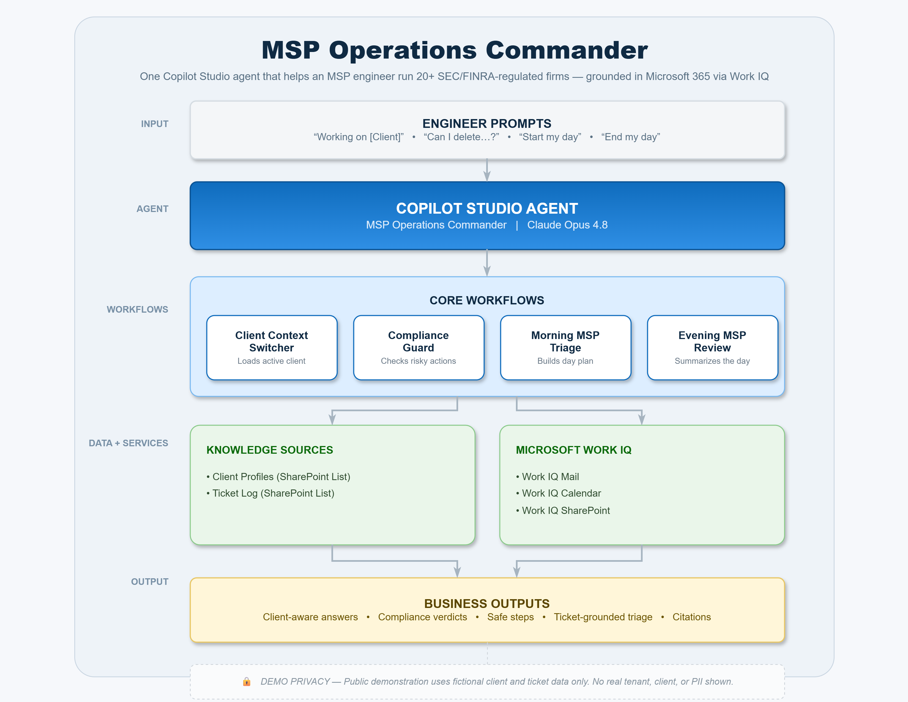

# 🚀 MSP Operations Commander

**AI-powered operations command center for Managed Service Providers — built with Microsoft Copilot Studio**

> Agents League Hackathon — Enterprise Agents Battle | June 2026

## 🎥 Demo Video

Watch the demo here: [MSP Operations Commander Demo](https://youtu.be/Ba-ahSLbW48)

> For privacy, the demo uses fictional client and ticket data. No real client names, contacts, tickets, domains, tenant details, or sensitive information are shown.

---

## 🎯 The Problem

Managed Service Providers (MSPs) juggle dozens of client environments simultaneously. Each client has unique compliance requirements, security policies, third-party integrations, and IT configurations. Engineers waste hours context-switching between clients, looking up policies, and manually checking compliance before taking action.

## 💡 The Solution

The **MSP Operations Commander** transforms a Copilot Studio agent into an intelligent operations hub that:

- **Switches client context instantly** — Say "Working on Pinnacle Coaching Group" and the agent loads that client's full environment profile, contacts, compliance rules, and ticket history
- **Guards compliance automatically** — Before risky actions (offboarding, CA changes, license removal), the agent checks client-specific compliance rules and warns the engineer
- **Runs morning-to-evening orchestration** — Morning triage builds a prioritized day plan; evening review summarizes completed work, flags compliance actions, and previews tomorrow
- **Learns from ticket history** — Cross-references past tickets to identify recurring issues and recommend proven solutions

## 🏗️ Architecture

  

  <em>Click the diagram to open it full size.

The MSP Operations Commander is built as a Microsoft Copilot Studio agent with four custom workflows connected to structured knowledge sources and integrations.

| Layer | Component | Purpose |
|---|---|---|
| Agent | **MSP Operations Commander (built on InhouseCIO Assistant)** | Main Copilot Studio agent used by the MSP engineer |
| Workflow | **Client Context Switcher** | Loads active client profile, compliance notes, special instructions, and ticket history |
| Workflow | **Compliance Guard** | Checks risky IT actions against client-specific compliance rules |
| Workflow | **Morning MSP Triage** | Builds a structured day plan using active ticket history, priority, client impact, and compliance risk |
| Workflow | **Evening MSP Review** | Summarizes completed work, pending items, compliance-sensitive actions, follow-ups, and tomorrow’s priorities |
| Knowledge Source | **Client Profiles** | SharePoint list containing client environment and compliance context |
| Knowledge Source | **Ticket Log** | SharePoint list containing structured ticket history |
| Knowledge Source | **SharePoint Knowledge Base** | Internal troubleshooting and process documentation |
| Knowledge Source | **Microsoft Learn** | Microsoft product guidance |
| Integration | **Work IQ** | Mail, calendar, and people context |
| Integration | **VirusTotal API** | Threat intelligence for phishing and suspicious link analysis |

### Architecture Flow

| Input | Agent Workflow | Knowledge / Tool Used | Output |
|---|---|---|---|
| `Working on Pinnacle Coaching Group` | Client Context Switcher | Client Profiles + Ticket Log | Active client context loaded |
| `Can I delete an offboarded user account?` | Compliance Guard | Client Profiles + Ticket Log | Safe compliance guidance |
| `Start my day` | Morning MSP Triage | Ticket Log + Client Profiles | Prioritized MSP day plan |
| `End my day` | Evening MSP Review | Ticket Log + Client Profiles | End-of-day operations summary |

## ✨ Key Features

### 1. Client Context Switcher

| Trigger | What Happens |
|---------|-------------|
| "Working on Pinnacle Coaching Group" | Loads full client profile: contacts, environment, compliance rules, tools, and past tickets |
| "Switch to Ridgewood Capital Advisors" | Instantly switches context to a different client |

- Uses `Global.ClientName` variable accessible across all topics
- Pulls verified data from SharePoint Client Profiles list
- No client tenant connection needed — all data lives in the MSP's own tenant

### 2. Compliance Guard

| Action | Agent Response |
|--------|----------------|
| "Can I delete this user account?" | Checks client compliance notes → Pinnacle Coaching Group: "Do NOT delete. Disable, convert mailbox to shared, remove license." |
| "Change Conditional Access policy" | Checks CA notes → Ridgewood Capital Advisors: "FINRA registered. Global Relay archiving required. Document all changes." |

- Validates every risky action against client-specific rules
- Returns: Verdict, reasoning, required approval, safe steps, and client-specific warnings
- Prevents compliance violations before they happen

### 3. Morning MSP Triage

**Trigger:** `Start my day`

Returns a structured day plan:

1. Active critical or urgent items
2. High-priority tickets
3. Waiting client responses
4. Calendar-aware day plan
5. Compliance flags for active clients
6. Recommended first action

### 4. Evening MSP Review

**Trigger:** `End my day`

Returns an end-of-day summary:

1. Completed work
2. Pending or unresolved items
3. Compliance actions taken today
4. Follow-ups needed
5. Tomorrow preview
6. End-of-day summary paragraph

## 🔒 Security & Compliance

- **No client tenant access required** — All data stored in the MSP's own SharePoint
- **FINRA/SEC compliance aware** — Built for regulated financial advisory firms
- **Email archiving awareness** — Knows which clients use Global Relay, Redtail, or Smarsh
- **Account retention rules** — Prevents accidental deletion of accounts that must be retained
- **VirusTotal integration** — Real-time threat intelligence for phishing analysis
- **No AI hallucination** — General knowledge disabled; agent uses only verified SharePoint data

## 📊 Client Coverage (Demo)

| Client | Industry | Environment | Compliance |
|--------|----------|-------------|------------|
| Pinnacle Coaching Group | Executive Coaching | Full Cloud | No account deletion, mailbox retention |
| Ridgewood Capital Advisors | Wealth Management | Full Cloud | FINRA, Global Relay, CA enforced |
| Silverline Wealth Partners | Financial Advisory | Full Cloud | FINRA, CodeTwo, SEC regulated |
| Summit Financial Group | Financial Advisory | Full Cloud | FINRA, Smarsh archiving |
| Legacy Wealth Advisors | Financial Advisory | Full Cloud | FINRA, Redtail, Wealthbox CRM |

## 🛠️ Tech Stack

- **Microsoft Copilot Studio** — Agent builder with custom topics and generative AI
- **SharePoint Online** — Client Profiles list + Ticket Log list as structured knowledge sources
- **Work IQ (Microsoft Graph)** — Mail, calendar, and people integration
- **VirusTotal API** — Custom connector for real-time threat intelligence
- **Power Automate** — Ticket alert flows with Adaptive Cards
- **Microsoft Teams** — Primary agent channel

## 👤 About the Builder

**Adel Alkhatib** — Cloud System Engineer at InhouseCIO, LLC

- Manages 20+ financial advisory firm clients across Microsoft 365 environments
- Works remotely from Jordan, supporting US-based clients
- Built this agent to solve his own daily operational challenges as a solo MSP engineer

## 📋 Judging Criteria Alignment

| Criteria (Weight) | How This Agent Delivers |
|-------------------|------------------------|
| Accuracy & Relevance (20%) | Uses only verified SharePoint data, no hallucination, client-specific responses |
| Reasoning & Multi-step (20%) | Compliance Guard validates actions against multiple data points; Morning Triage cross-references tickets, clients, and compliance |
| Reliability & Safety (20%) | Compliance-first design for SEC/FINRA regulated firms; prevents account deletion, enforces retention policies |
| Creativity & Originality (15%) | Multi-tenant MSP context switching is unique — no other entry manages 20+ client environments simultaneously |
| UX & Presentation (15%) | Natural language triggers, structured outputs, morning-to-evening workflow orchestration |
| Completeness (10%) | Full lifecycle: context loading → compliance checking → daily orchestration → ticket history |

---

*Built for the Agents League Hackathon — Enterprise Agents Battle, June 2026*
